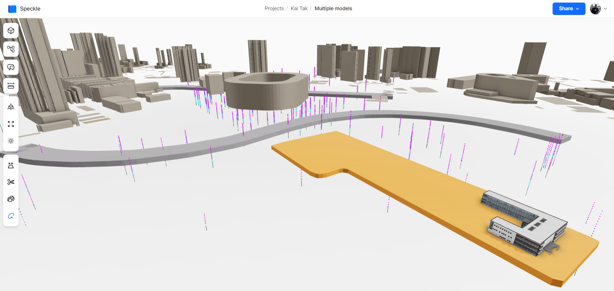
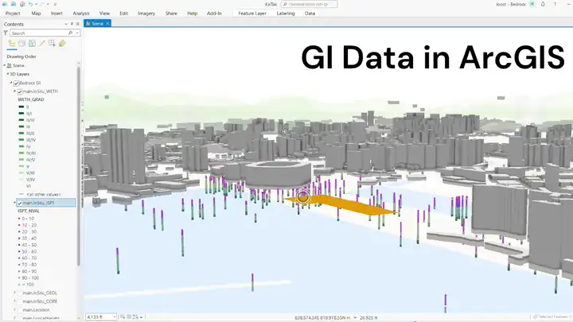

import { Card } from '@astrojs/starlight/components';

<Card title="Hong Kong GI Data">
3D geospatial ground investigation in Kai Tak, Hong Kong using Speckle and ArcGIS online

{/*  */}

</Card>

<Card title="GI Data & Ground Model">

GI data, the derived Leapfrog ground model, and a tunnel in Speckle.

</Card>