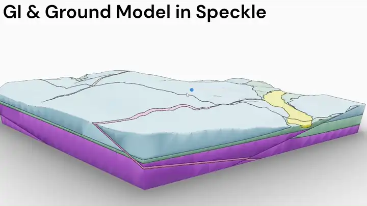

Geotechnical data is inherently geospatial, yet it's often trapped in formats that don't take advantage of this spatial nature.

Understanding what geospatial data is, and why geotechnical data fits this model, unlocks powerful workflows for analysis, visualization, and integration.

## What is geospatial data?

Geospatial data is information that is associated with a specific location on Earth. There are two main types:

### Raster data

Continuous surfaces represented as grids of pixels, like satellite imagery or digital elevation models (DEMs). Think of these as spatial "heat maps" showing how values change across a landscape.

### Vector data

Discrete objects represented by geometric shapes with attached properties. According to the Open Geospatial Consortium (OGC) [Simple Feature Access specification](https://www.ogc.org/standards/sfa/), vector data uses three basic geometries:

- **POINT**: A single location (like a borehole collar)
- **LINESTRING**: A connected series of points (like a borehole path or geological layer boundary)
- **POLYGON**: An enclosed area (like a site boundary or geological unit)

Unlike many CAD drawings, which often lack georeferencing, geospatial data explicitly encodes real-world coordinates through defined spatial reference systems.

## Why geotechnical data is naturally geospatial

Ground investigation data is collected at specific locations on Earth's surface and extends into the subsurface. Every piece of geotechnical data has inherent spatial characteristics:

- **Borehole locations**: Specific easting, northing, and elevation coordinates
- **In-situ tests**: Performed at discrete depths below known surface locations
- **Laboratory samples**: Extracted from specific depths at known locations
- **Monitoring data**: Time-series measurements at fixed spatial positions

This makes geotechnical data naturally suited to **3D geospatial vector representation**:

| Geotechnical Element  | Geospatial Geometry | Example                      |
| --------------------- | ------------------- | ---------------------------- |
| Borehole/CPT location | 3D LINESTRING Z     | From surface to final depth  |
| Sample point          | 3D POINT Z          | Sample at 5.2m depth         |
| Geological layer      | 3D LINESTRING Z     | Clay layer from 2.1m to 4.7m |
| In-situ test          | 3D POINT Z          | SPT at 3.0m depth            |

<svg viewBox="-8,-24,500,272" style="max-width: 100%; height: auto; font: 11.43px sans-serif; overflow: visible;" xmlns="http://www.w3.org/2000/svg" xmlns:xlink="http://www.w3.org/1999/xlink">
    <g fill="none" stroke="currentColor">
        <path d="&#10; M0,0&#10; V16&#10; h16&#10;" />
        <path d="&#10; M16,16&#10; V48&#10; h16&#10;" />
        <path d="&#10; M16,16&#10; V64&#10; h16&#10;" />
        <path d="&#10; M16,16&#10; V80&#10; h16&#10;" />
        <path d="&#10; M16,16&#10; V96&#10; h16&#10;" />
        <path d="&#10; M16,16&#10; V112&#10; h16&#10;" />
        <path d="&#10; M32,112&#10; V144&#10; h16&#10;" />
        <path d="&#10; M32,112&#10; V160&#10; h16&#10;" />
        <path d="&#10; M32,112&#10; V176&#10; h16&#10;" />
        <path d="&#10; M32,112&#10; V192&#10; h16&#10;" />
        <path d="&#10; M32,112&#10; V208&#10; h16&#10;" />
        <path d="&#10; M32,112&#10; V224&#10; h16&#10;" />
        <path d="&#10; M32,112&#10; V240&#10; h16&#10;" />
    </g>
    <g fill="currentColor">
        <g transform="translate(0,0)">
            <circle cx="0" r="2" /><text dy="0.32em" x="6">
                <tspan font-weight="400">Projects</tspan>
            </text><text dy="0.32em" x="300" text-anchor="start" />
            <title>Projects</title>
        </g>
        <g transform="translate(0,16)">
            <circle cx="16" r="2" /><text dy="0.32em" x="22">
                <tspan font-weight="400">Locations</tspan>
            </text><text dy="0.32em" x="300" text-anchor="start">LINESTRING Z</text>
            <title>Projects/Locations</title>
        </g>
        <g transform="translate(0,32)"><text dy="0.32em" x="38">
                <tspan font-weight="600">In-Situ Observations &amp; Measurements</tspan>
            </text><text dy="0.32em" x="300" text-anchor="start" />
            <title>Projects/Locations/In-Situ Observations &amp; Measurements</title>
        </g>
        <g transform="translate(0,48)">
            <circle cx="32" r="2" /><text dy="0.32em" x="38">
                <tspan font-weight="400">Raw CPT Data</tspan>
            </text><text dy="0.32em" x="300" text-anchor="start">None</text>
            <title>Projects/Locations/Raw CPT Data</title>
        </g>
        <g transform="translate(0,64)">
            <circle cx="32" r="2" /><text dy="0.32em" x="38">
                <tspan font-weight="400">Interpreted CPT Soil Profiles</tspan>
            </text><text dy="0.32em" x="300" text-anchor="start">LINESTRING Z</text>
            <title>Projects/Locations/Interpreted CPT Soil Profiles</title>
        </g>
        <g transform="translate(0,80)">
            <circle cx="32" r="2" /><text dy="0.32em" x="38">
                <tspan font-weight="400">Geological Descriptions</tspan>
            </text><text dy="0.32em" x="300" text-anchor="start">LINESTRING Z</text>
            <title>Projects/Locations/Geological Descriptions</title>
        </g>
        <g transform="translate(0,96)">
            <circle cx="32" r="2" /><text dy="0.32em" x="38">
                <tspan font-weight="400">Vane Shear Test</tspan>
            </text><text dy="0.32em" x="300" text-anchor="start">POINT Z</text>
            <title>Projects/Locations/Vane Shear Test</title>
        </g>
        <g transform="translate(0,112)">
            <circle cx="32" r="2" /><text dy="0.32em" x="38">
                <tspan font-weight="400">Samples</tspan>
            </text><text dy="0.32em" x="300" text-anchor="start">POINT Z or LINESTRING Z</text>
            <title>Projects/Locations/Samples</title>
        </g>
        <g transform="translate(0,128)"><text dy="0.32em" x="54">
                <tspan font-weight="600">Laboratory Tests</tspan>
            </text><text dy="0.32em" x="300" text-anchor="start" />
            <title>Projects/Locations/Samples/Laboratory Tests</title>
        </g>
        <g transform="translate(0,144)">
            <circle cx="48" r="2" /><text dy="0.32em" x="54">
                <tspan font-weight="400">Densities</tspan>
            </text><text dy="0.32em" x="300" text-anchor="start" />
            <title>Projects/Locations/Samples/Densities</title>
        </g>
        <g transform="translate(0,160)">
            <circle cx="48" r="2" /><text dy="0.32em" x="54">
                <tspan font-weight="400">Moisture Contents</tspan>
            </text><text dy="0.32em" x="300" text-anchor="start" />
            <title>Projects/Locations/Samples/Moisture Contents</title>
        </g>
        <g transform="translate(0,176)">
            <circle cx="48" r="2" /><text dy="0.32em" x="54">
                <tspan font-weight="400">Atterberg Limits</tspan>
            </text><text dy="0.32em" x="300" text-anchor="start" />
            <title>Projects/Locations/Samples/Atterberg Limits</title>
        </g>
        <g transform="translate(0,192)">
            <circle cx="48" r="2" /><text dy="0.32em" x="54">
                <tspan font-weight="400">Particle Size Distributions</tspan>
            </text><text dy="0.32em" x="300" text-anchor="start" />
            <title>Projects/Locations/Samples/Particle Size Distributions</title>
        </g>
        <g transform="translate(0,208)">
            <circle cx="48" r="2" /><text dy="0.32em" x="54">
                <tspan font-weight="400">Consolidation Tests</tspan>
            </text><text dy="0.32em" x="300" text-anchor="start" />
            <title>Projects/Locations/Samples/Consolidation Tests</title>
        </g>
        <g transform="translate(0,224)">
            <circle cx="48" r="2" /><text dy="0.32em" x="54">
                <tspan font-weight="400">Triaxial Tests</tspan>
            </text><text dy="0.32em" x="300" text-anchor="start" />
            <title>Projects/Locations/Samples/Triaxial Tests</title>
        </g>
        <g transform="translate(0,240)">
            <circle cx="48" r="2" /><text dy="0.32em" x="54">
                <tspan font-weight="400">Direct Shear Tests</tspan>
            </text><text dy="0.32em" x="300" text-anchor="start" />
            <title>Projects/Locations/Samples/Direct Shear Tests</title>
        </g>
    </g>
    <text fill="currentColor" dy="0.32em" y="-16" x="0" text-anchor="start" font-weight="bold">Tables
    <text fill="currentColor" dy="0.32em" y="-16" x="300" text-anchor="start" font-weight="bold">Geospatial Geometry Type</text>
</svg>

## The spatial awareness advantage

When geotechnical data is treated as geospatial data, it becomes **spatially aware**, it 'knows' the relationships between locations, distances, and coordinate systems. This enables:

<dl>

<dt>Automatic coordinate transformations</dt>
<dd>No more manual coordinate conversion errors when working with different engineering drawings or survey systems.</dd>

<dt>
Spatial queries and analysis</dt>
<dd>Spatial queries allow you to query things like:
    <ul class="list-disc list-inside">
        <li>"Show me all boreholes within 50m of the proposed foundation"</li>
        <li>"Find SPT values in sandy soils between 5-10m depth"</li>
    </ul>
</dd>

<dt>Integration with other spatial datasets</dt>
<dd>Geotechnical data can be directly combined with:
    <dd>
        <ul class="list-disc list-inside">
            <li>Topographic maps and aerial imagery</li>
            <li>Existing infrastructure and utilities</li>
            <li>Environmental data (flooding, contamination)</li>
            <li>Planning and regulatory boundaries</li>
        </ul>
    </dd>
</dl>

## Spatial Reference Systems

Geospatial data achieves its spatial awareness through [Spatial Reference Systems](https://en.wikipedia.org/wiki/Spatial_reference_system) (SRS), standardized definitions that link coordinates to real locations on Earth.

See the [Spatial Reference Systems](/explanation/concepts/spatial-reference-systems/) explanation for more.

## Breaking free from format silos

Traditional geotechnical data formats (AGS, DIGGS, GEF) are good at data exchange but create data silos that limit interoperability. 
The purpose of Bedrock is NOT to become THE standard for GI data, because we don’t need [15 instead of 14 competing standards](https://xkcd.com/927/).
By recognizing geotechnical data as geospatial data, we can:

- **Visualize** data in any GIS software (QGIS, ArcGIS)
- **Analyze** using spatial statistics and geostatistical methods
- **Integrate** with BIM models, CAD drawings, and web applications
- **Share** through standard web mapping services
- **Process** using the rich ecosystem of geospatial analysis tools. We like Python, but with open formats you can use any language or toolset, like [R](https://www.r-project.org/) or [Julia](https://julialang.org/).

## Geospatial databases

Geospatial databases are specialized databases that can store and work with geospatial data.
Unlike regular databases that only handle text and numbers, these databases understand spatial relationships. By storing geospatial data in databases rather than files, you gain powerful querying capabilities and can efficiently manage large, complex 3D spatial datasets.

Geospatial databases like [PostGIS](https://postgis.net/) (PostgreSQL-based) or [GeoPackage](https://www.geopackage.org/) (SQLite-based) combine the benefits of:

- **Relational structure**: Store [hierarchical geotechnical data](/explanation/hierarchical-structure/) efficiently.
- **Spatial capabilities**: Perform geographic queries and analysis
- **Multi-user access**: Server databases like PostGIS support concurrent users; GeoPackage is better for single-user or read-heavy scenarios
- **Data integrity**: Enforce relationships and constraints
- **Performance**: Spatial indexing makes queries fast even with large datasets

<!-- For example, you can query: "Show me all samples from sandy layers within 100m of the proposed building foundation" - combining spatial relationships, geological properties, and project geometry in a single operation. -->

## The foundation for modern workflows

Treating geotechnical data as geospatial data isn't just about changing file formats, it's about unlocking modern, integrated workflows that connect subsurface investigations with the broader built environment.
This spatial foundation enables many possibilities from viewing subsurface data on a web map to integrating digital twins of infrastructure projects.

## Bridging GIS and Engineering Workflows

Most engineering tools, like Revit and BIM 360, aren’t natively geospatial and often rely on local coordinate systems. Even Civil 3D, which supports projected coordinate systems, can be difficult to align cleanly with GIS data.

Bedrock avoids fragile format conversions by structuring geotechnical data in open geospatial formats like [GeoPackage](https://www.geopackage.org/), and using platforms like [Speckle](https://speckle.systems/) to integrate with AEC tools. This enables boreholes, tests, and ground models to be visualized directly alongside CAD and BIM models in Revit, Civil 3D, or Rhino.

<figure style="margin-inline: block; display: block;">

<figcaption>
  GI data, the derived Leapfrog ground model and a tunnel in Speckle. <a href="https://app.speckle.systems/projects/7a489ac0d4/models/$epsg:2193-7839%2Fgeo%2Fgeology-model,65b4cf97d5,9069ef2b2b">Click here to explore for yourself on Speckle.</a>
</figcaption>
</figure>
